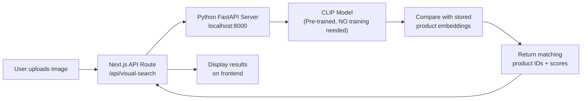

# AI Visual Search — Full Implementation Plan

Build a **real AI-powered "search by image"** feature for your graduation project using a Python microservice with the CLIP model.

## How It Works

```
User uploads/captures photo → Next.js sends to Python server (localhost:8000) →
CLIP generates image embedding → Compare against all product embeddings (cosine similarity) →
Return top matching products → Next.js displays them
```

## Architecture



## What Already Exists ✅

| Component | Status |
|---|---|
| `VisualSearch.tsx` component (UI with upload/camera) | ✅ Built — but uses **mock search** (just a `setTimeout`) |
| `imageVector` column in Prisma schema (`vector(2048)`) | ✅ Column exists in DB |
| `pgvector` extension enabled | ✅ Enabled in schema |
| VisualSearch wired into Header | ✅ Works — opens modal from nav |
| Python 3.14.3 installed | ✅ Available |
| 45+ products with images in DB | ✅ Ready |

## What We Need To Build

### Phase 1: Python FastAPI Server (new `visual-search-server/` folder)

Create a standalone Python microservice at the project root:

```
my-app/
├── visual-search-server/          ← NEW
│   ├── main.py                    # FastAPI app with 2 endpoints
│   ├── generate_embeddings.py     # Script to embed all product images
│   ├── requirements.txt           # Python dependencies
│   └── embeddings/                # Cached embeddings storage
│       └── products.pkl           # Pre-computed product embeddings
```

#### `main.py` — Two endpoints:
1. **`POST /search`** — Accepts an image (base64), generates its CLIP embedding, compares with all product embeddings, returns top-N matching product IDs + similarity scores
2. **`GET /health`** — Health check

#### `generate_embeddings.py` — One-time setup script:
- Connects to your Supabase PostgreSQL DB
- Fetches all products with their image URLs
- Downloads each image → generates CLIP embedding
- Saves embeddings to `embeddings/products.pkl`
- **Re-run this whenever you add/change products** (takes ~30 seconds)

#### Model Choice: **CLIP ViT-B/32** via `open_clip`
- Pre-trained (zero training needed)
- ~600MB download on first run, cached after
- Generates 512-dimensional embeddings (we'll update schema from 2048 → 512)
- Works great for product similarity matching

---

### Phase 2: Next.js API Route Bridge

#### [NEW] `app/api/visual-search/route.ts`
- Receives the image from the frontend
- Forwards it to `http://localhost:8000/search`
- Returns the matched products with full details from the database
- Acts as a proxy so the frontend never talks to Python directly

---

### Phase 3: Update Frontend

#### [MODIFY] `components/VisualSearch.tsx`
- Replace the **mock search** (`setTimeout`) with a real API call to `/api/visual-search`
- Display actual matched products with thumbnails, names, prices, and similarity scores
- Add a "View Product" link for each result
- Keep the existing upload/camera UI exactly as-is

---

## Prisma Schema Change

```diff
model Product {
  ...
- imageVector Unsupported("vector(2048)")?
+ imageVector Unsupported("vector(512)")?
  ...
}
```

> [!NOTE]
> We're changing from `vector(2048)` to `vector(512)` because CLIP ViT-B/32 produces 512-dimensional embeddings. Since `imageVector` is currently empty (never populated), this change has zero data impact.

---

## Setup & Run Workflow

```
Step 1: Install Python dependencies
        > cd visual-search-server
        > pip install -r requirements.txt

Step 2: Generate product embeddings (~30-60 seconds)
        > python generate_embeddings.py

Step 3: Start the Python server
        > python main.py                    ← runs on localhost:8000

Step 4: Start Next.js (as usual)
        > npm run dev                       ← runs on localhost:3000

Step 5: Click the 🔍 camera icon in the header → upload a product photo → see real results!
```

## User Review Required

> [!IMPORTANT]
> **Disk space:** The CLIP model will download ~600MB on first run. It caches in your user folder after that.

> [!IMPORTANT]
> **When you replace products later:** You just re-run `python generate_embeddings.py` — everything else stays the same. The entire AI pipeline is product-agnostic.

## Open Questions

> [!IMPORTANT]
> 1. **Do you have `pip` available?** Run `pip --version` in your terminal. If not, we may need to install it.
> 2. **How many results** should the visual search return? I'm planning **top 6** similar products. Would you prefer more or fewer?
> 3. **Similarity threshold:** Should we show all 6 results regardless of similarity, or only show products above a certain match percentage (e.g., only show if >30% similar)?

## Verification Plan

### Automated Tests
1. Start the Python server → hit `GET /health` → expect 200
2. Send a product image to `POST /search` → expect matching product IDs returned
3. Upload an image via the frontend VisualSearch modal → verify real results appear

### Manual Verification
- Upload a photo of headphones → should return electronics/headphones products
- Upload a shoe photo → should return footwear products  
- Test with the camera tab as well
- Verify the results link to actual product detail pages
